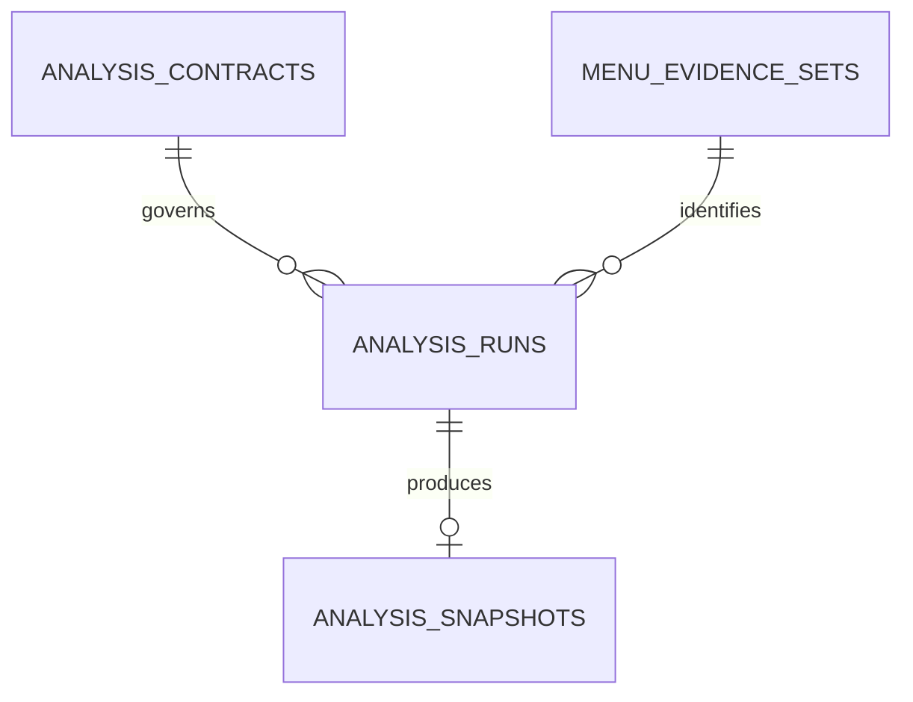
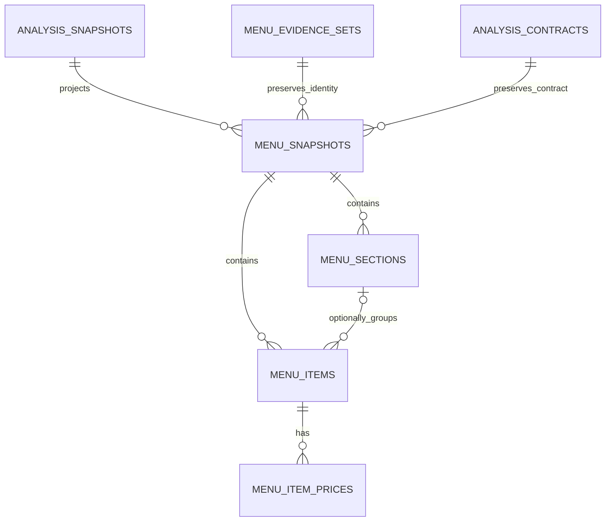
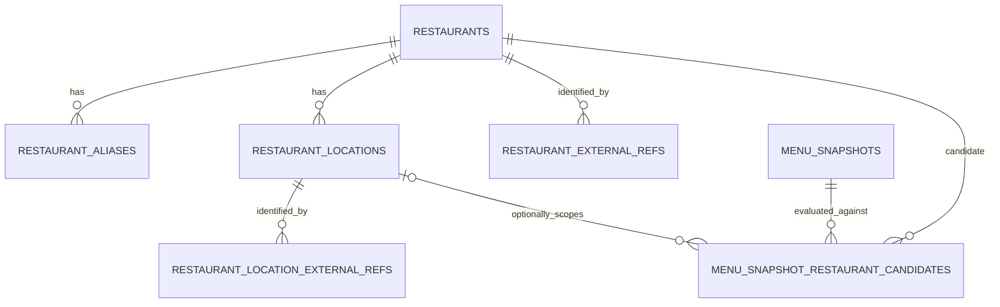
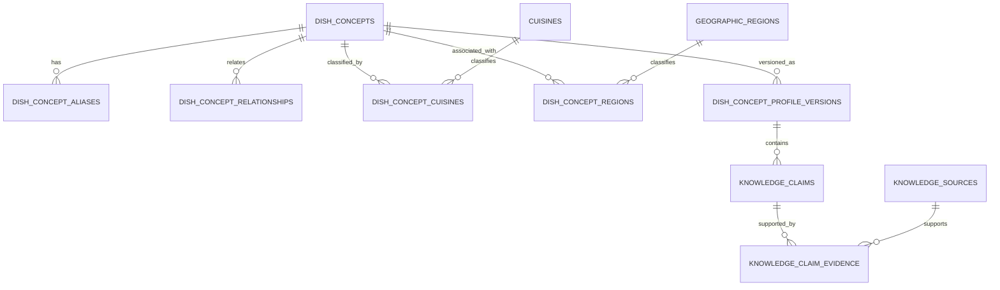

# Foodseyo Database Logical Model v3

**Status:** C2.2-A logical model accepted locally; no physical schema or migration
**Reviewed:** 2026-07-17

This document is the C2.2-A source of truth for the future relational model. It audits the external `Foodseyo Complete ERD v2` proposal against the implemented C2.1 cache, the canonical `FoodseyoAnalysis` contract, the active MVP, and the T7/T8 ordering.

It defines responsibilities, relationships, exclusions, and unresolved decisions. It does not define PostgreSQL types, nullability, keys, triggers, grants, Drizzle tables, SQL, or migrations. Those belong to later approved checkpoints. Nothing in this document authorizes a database mutation, application integration, Preview or Production rollout, image retention, account system, or new product capability.

## Audit conclusion

The v2 proposal is useful as a long-term domain inventory but is not an implementation-ready ERD. Version 3 makes five corrections:

1. preserve the implemented four-table C2.1 cache without repurposing it;
2. make structured menu projection the smallest next database candidate;
3. defer restaurant identity until T7 supplies evidence and T8 reopens identity;
4. replace ambiguous truth links and polymorphic evidence with versioned claims and real parent relations;
5. exclude storage, accounts, personalization, and community from the active model until their own product and security decisions exist.

The status labels in this document are normative:

| Status | Meaning |
| --- | --- |
| Implemented | Existing physical C2.1 source of truth; v3 cannot redefine it |
| Candidate | Eligible for the next physical-contract audit, not yet approved for implementation |
| Deferred | Logical direction only; prerequisite product or contract work is missing |
| Excluded | Outside the active MVP and current database program |

The simplified domain map is in [database-erd-master-map-v3.mmd](./database-erd-master-map-v3.mmd).

## Non-negotiable boundaries

- Raw images remain transient. No object, filename, per-image hash, Base64, or object-storage reference is persisted.
- `analysis_snapshots.canonical_result_json` remains the immutable exact-cache artifact and canonical source for later projections.
- Structured rows are deterministic projections, not a second provider result and not a dish-level semantic cache.
- A derived row never upgrades uncertain restaurant identity, evidence basis, dietary status, or allergen safety.
- `unknown` never becomes absence, false, safe, or confirmed.
- Restaurant identity retains canonical `status`, `basis`, and `scope`; it does not use a numeric confidence as truth.
- General culinary knowledge never overrides a source-stated menu fact and is never presented as restaurant-confirmed.
- Deferred user and community tables do not become active merely because they appear in a future diagram.
- Every implementation slice receives its own Development validation and Preview/Production gate. There is no final all-at-once C2.9 rollout.

## Implemented foundation: C2.1



| Entity | Responsibility | v3 treatment |
| --- | --- | --- |
| `analysis_contracts` | Immutable five-value provider/canonical/consistency contract identity | Retain exactly as implemented |
| `menu_evidence_sets` | Exact transient-input identity and safe source metadata | Retain exactly as implemented; do not turn it into persistent image storage |
| `analysis_runs` | Append-only ownership attempt, lease, ready/failed state, and safe error history | Retain exactly as implemented |
| `analysis_snapshots` | Immutable validated canonical result, exact result fingerprint, expiry, access, and guarded invalidation | Retain exactly as implemented |

The existing composite run/snapshot identity, one-processing-owner index, one-active-snapshot index, state checks, repository validation, and least-privilege grants remain authoritative. C2.2 must not weaken or duplicate them.

## Candidate next slice: structured menu projection

The first future relational slice is deliberately small.



### Candidate entity responsibilities

| Entity | Responsibility | Explicit non-responsibility |
| --- | --- | --- |
| `menu_snapshots` | One immutable successful projection of one canonical analysis snapshot under one projector version; preserves evidence and analysis-contract identity | Provider ownership, restaurant confirmation, mutable current-menu state |
| `menu_sections` | Ordered flat category/section labels inside one menu snapshot | Nested trees, restaurant identity, general culinary taxonomy |
| `menu_items` | Ordered source-derived menu item and translated presentation fields inside one menu snapshot; optional same-snapshot section | Reusable dish identity, cross-menu deduplication, general dish truth |
| `menu_item_prices` | Zero or more source-derived price observations for one item with explicit kind and currency context | Currency conversion, inferred price, mutable live price |

### Candidate corrections

- The proposed `analysis_snapshot_materializations` table is omitted from the first slice. A successful `menu_snapshots` row already records `(analysis_snapshot, projector_version)`; the whole projection is written in one transaction, so no partial or failed materialization row is needed.
- A later asynchronous projector may justify a separate attempt table, but it must be proven by an operational need rather than added preemptively.
- `menu_sections` are flat in the first slice. Nested sections introduce cycle prevention and are deferred until a real source requires them.
- `menu_items` reference their menu snapshot directly. The optional section must belong to the same snapshot, so unsectioned items remain representable without a synthetic category.
- Menu items are observations inside one immutable menu snapshot. They are not `dish_concepts`.
- `menu_item_option_groups` and `menu_item_option_values` remain deferred until the canonical result and user experience carry option data that must be queried relationally.

### Candidate logical invariants

C2.2-B must translate these into an enforcement matrix:

- at most one menu snapshot per `(analysis_snapshot, projector_version)`;
- the menu snapshot's evidence set and analysis contract are identical to its source analysis snapshot;
- projection reads only a structurally and semantically valid canonical snapshot;
- snapshot, sections, items, and prices commit atomically;
- all ordering is stable and unique within the correct parent;
- an optional section belongs to the same menu snapshot as its item;
- source and translated text remain distinct;
- price kind controls whether amount and currency are required or absent;
- projections are immutable and are not used by the live route in the first implementation checkpoint;
- invalidation or expiry of the source snapshot never silently turns a derived projection into an independently trusted analysis.

## Restaurant and location identity: deferred until T7/T8



| Entity | Responsibility | Status |
| --- | --- | --- |
| `restaurants` | Canonical restaurant-level identity after an identity contract exists | Deferred |
| `restaurant_aliases` | Source-aware alternate names, language, and normalization | Deferred |
| `restaurant_locations` | Physical branch identity belonging to one restaurant | Deferred |
| `restaurant_external_refs` | Provider identifier whose scope is restaurant-level | Deferred |
| `restaurant_location_external_refs` | Provider identifier whose scope is branch-level | Deferred |
| `menu_snapshot_restaurant_candidates` | Preserved candidate result using canonical status, basis, scope, conflict, method, and evidence | Deferred; replaces v2 `menu_snapshot_restaurant_links` |

The word `owns` is removed: a candidate relationship does not establish ownership. A location candidate must belong to the same restaurant candidate through a composite relationship. A branch association is allowed only when canonical status is `confirmed`, scope is `branch`, and branch-specific evidence remains available.

Numeric confidence may later support internal ranking if it has a calibrated definition, but it cannot replace or upgrade canonical status, basis, scope, conflict, or evidence.

## Evidence artifacts: conditionally excluded

The v2 `menu_evidence_artifacts` and `menu_evidence_set_members` entities are removed from the active v3 model.

They may return only after a product decision approves permanent source retention and defines:

- user consent and deletion;
- storage location and access control;
- retention and expiry;
- copyright and source-excerpt policy;
- deduplication scope and cross-user hash privacy;
- object deletion after all references expire;
- whether a persisted artifact is evidence, an upload, or both.

Until then, `menu_evidence_sets` stores only the already approved exact fingerprint identity and safe metadata. The current transient image pipeline remains unchanged.

## Culinary knowledge: deferred reviewed-claim model

The culinary domain remains a long-term candidate, but v2's direct truth links are narrowed.



### Retained deferred vocabularies

- `dish_concepts`, `dish_concept_aliases`, `dish_concept_relationships`
- `cuisines`, `geographic_regions`, `dish_concept_cuisines`, `dish_concept_regions`
- `dish_concept_profile_versions`
- `sensory_terms`
- `ordinal_scales`, `ordinal_scale_values`
- `ingredient_categories`, `ingredient_concepts`, `ingredient_aliases`
- `preparation_methods`
- `dietary_traits`, `allergens`
- `knowledge_sources`

### Replaced claim model

`knowledge_claims` is the real parent of one typed claim detail. Typed details may cover sensory, ordinal, ingredient, preparation, dietary, or allergen assessment. `knowledge_claim_evidence` references that parent, so evidence never uses an unenforceable `(fact_type, fact_id)` pseudo-foreign-key.

The following v2 tables are therefore not retained as independent top-level facts:

- `dish_concept_sensory_terms`
- `dish_concept_ordinal_attributes`
- `dish_concept_ingredients`
- `dish_concept_preparation_methods`
- `dish_concept_dietary_assessments`
- `dish_concept_allergen_assessments`
- `dish_profile_evidence_links`

Their queryable attributes move into typed detail records owned by `knowledge_claims`.

The v2 `ingredient_dietary_traits` and `ingredient_allergens` direct links are also removed. Ingredient-derived dietary or allergen information is contextual knowledge with provenance, review state, uncertainty, and versioning—not timeless truth and never a restaurant safety guarantee.

### Deferred knowledge invariants

- profile corrections append a new version;
- at most one published profile version is active for one concept and policy;
- every published claim has review state and sufficient provenance;
- each ordinal value belongs to the stated scale;
- minimum, typical, and maximum ordering is valid;
- relationship type defines directionality, symmetry, duplicate reversal, and cycle policy;
- no model-created knowledge becomes published solely because it was generated;
- source-stated menu claims remain separate from culinary baseline claims.

## Menu-item analysis and merge: deferred

The normalized menu-claim model is not required to materialize sections, items, and prices. It follows only after the structured menu slice and reviewed knowledge model are justified.

Version 3 changes:

- `menu_item_concept_links` becomes `menu_item_concept_candidates`; one selected candidate is not automatically a confirmed identity.
- `menu_item_analyses` must preserve composite agreement among menu item, analysis snapshot, evidence set, and analysis contract.
- A common `menu_item_claims` parent owns basis, availability, uncertainty, and preserved evidence reference; typed sensory, ordinal, ingredient, preparation, dietary, and allergen details hang from it.
- Evidence links reference the claim parent, not a polymorphic table/id pair.
- `menu_item_effective_profiles` is not one-to-one with an analysis. Multiple immutable outputs may exist for different merge-policy and baseline-profile versions.
- An effective profile records the exact merge policy and every baseline version used.

The precedence remains:

```text
source_stated
> inferred_from_source
> culinary_baseline
> unknown
```

A contradiction in source evidence suppresses only the affected baseline claim. `unknown` remains unknown. Dietary or allergen safety is never derived as a guaranteed result.

## User, personalization, Passport, and community: excluded

The following v2 entities are excluded from the active v3 model:

- `app_users`
- `user_preference_profiles`
- `user_sensory_preferences`
- `user_ordinal_preferences`
- `user_dietary_requirements`
- `user_allergen_avoidances`
- `user_saved_menu_items`
- `food_passport_entries`
- `menu_item_reviews`
- `review_media`
- `analysis_feedback`
- generic `audit_events`

They require a separate product, authentication, authorization, privacy, retention, moderation, deletion, and possibly row-level-security design. Their exclusion is not a rejection of the product idea; it prevents speculative tables from becoming an accidental MVP commitment.

A future audit system must use allowlisted safe event fields. Generic `before_json` and `after_json` payloads are not accepted because they can copy menu content, canonical results, or personal data into logs.

## Complete v2 disposition

| v2 area | Retain | Replace, merge, or narrow | Defer or exclude |
| --- | --- | --- | --- |
| Exact cache | `analysis_contracts`, `menu_evidence_sets`, `analysis_runs`, `analysis_snapshots` | None; implemented schema governs | None |
| Structured menu | `menu_snapshots`, `menu_sections`, `menu_items`, `menu_item_prices` | Flat sections first; direct snapshot identity; no separate synchronous materialization table | Option groups and values deferred |
| Restaurant | Restaurants, aliases, locations, two scope-specific external-ref tables | `menu_snapshot_restaurant_links` → candidates; remove ownership semantics and numeric-confidence truth | Entire area after T7/T8 |
| Persisted evidence | None in active model | Existing evidence set remains fingerprint identity only | Artifacts and members blocked by retention decision |
| Dish concepts | Concepts, aliases, relationships, cuisine/region mappings, profile versions | Relationship semantics and active-version policy must be explicit | Entire area deferred |
| Vocabularies | Sensory terms, ordinal scales/values, ingredients, preparation, dietary traits, allergens, sources | Ordinal value must remain bound to its scale | Entire area deferred |
| Knowledge facts | None as standalone v2 fact rows | Common `knowledge_claims`, typed details, and `knowledge_claim_evidence` | Ingredient truth links removed pending versioned claim design |
| Menu analysis | Menu item analyses and typed query intent | Candidate naming, common claim parent, composite identity, versioned effective profiles | Entire area deferred |
| User/community | None in active model | Future bounded-context redesign | All v2 user/community tables excluded |
| Audit | Safe structural events only in future | Remove generic entity pointer and before/after payload | Generic `audit_events` excluded |

## Relationship corrections required before physical design

1. A restaurant location must belong to the same restaurant referenced by a candidate relationship.
2. An ordinal value must belong to the same ordinal scale referenced by its claim or preference.
3. A menu snapshot must preserve the exact evidence and contract of its source analysis snapshot.
4. An optional menu section must belong to the same menu snapshot as its item.
5. A selected concept or restaurant candidate is at most one per exact context; any “must have one” rule belongs to a guarded state transition.
6. Symmetric and directional dish relationships require different duplicate and cycle rules.
7. Every evidence link must target a real claim parent with an enforceable foreign key.
8. Soft deletion cannot silently free a natural identifier unless reuse policy explicitly allows it.
9. Append-only and immutable are permission and transaction rules, not documentation adjectives.
10. Foreign-key existence and foreign-key lookup indexing are separate physical-design checks.

## Unresolved product decisions

These decisions are recorded for C2.2-C. Each blocks only the affected domain.

| ID | Decision | Safe default until decided | Blocks |
| --- | --- | --- | --- |
| P-01 | Permanently store uploaded menu artifacts? | No; transient only | Evidence artifacts and object references |
| P-02 | If stored, retention, consent, access, copyright, and deletion policy? | Store nothing | Evidence artifacts |
| P-03 | May restaurant identity ever auto-confirm? | No; preserve candidates and canonical evidence rules | Restaurant candidate selection |
| P-04 | How long are structured menu projections retained and when does source invalidation disable them? | Development-only, not a public read source | Menu projection rollout |
| P-05 | Are nested menu sections required? | Flat sections only | Nested section hierarchy |
| P-06 | Which price kinds, currencies, ranges, and option deltas are supported? | Source amount/currency only; no conversion | Price and option physical contract |
| P-07 | May AI propose culinary knowledge? | Proposal or review queue only; never auto-publish | Knowledge ingestion |
| P-08 | Who may review and publish a knowledge profile? | No published profile without an authority model | Knowledge publication |
| P-09 | What source excerpts may be retained? | Identifiers and safe citations only; no copied excerpt | Knowledge evidence |
| P-10 | Does a changed baseline create a new effective profile automatically? | Recompute only through an explicit versioned job | Effective guidance |
| P-11 | Authentication and anonymous identity model? | No persistent user identity | User tables |
| P-12 | Store allergen severity or medical-adjacent profile data? | No | Personalization |
| P-13 | Food Passport visibility and deletion defaults? | Private concept only; no implementation | Passport |
| P-14 | Review, media, moderation, and privacy policy? | No community storage | Community |

## Revised checkpoint order

### C2.2-A — logical model audit

Completed by this document. No database or runtime change.

### C2.2-B — physical integrity contract

Define columns, PostgreSQL types, nullability, defaults, keys, deletion behavior, uniqueness, checks, indexes, immutability, grants, and enforcement ownership for:

- the implemented four-table C2.1 foundation as a compatibility boundary;
- only the four candidate structured-menu tables.

Deferred domains do not receive speculative physical contracts yet.

### C2.2-C — scoped product and security decisions

Resolve only decisions needed by the next slice first. Community or authentication decisions must not block unrelated structured-menu work; image-retention decisions must block artifact storage.

### C2.2-D — unexecuted schema draft

Prepare reviewed Drizzle and SQL drafts for the approved next slice, validate dependency order and static integrity, but do not connect to a database or generate a migration until separately authorized.

### C2.3 — Development-only structured menu implementation

If C2.2-B/C/D pass, implement the approved minimal projection in Development with atomic rollback and real PostgreSQL validation. Do not add it to the live read path in the same checkpoint.

### T7/T8 before restaurant identity implementation

T7 source acquisition must define normalized URLs, SSRF defense, source classification, and preserved evidence. T8 then reopens restaurant and branch identity. Restaurant tables are not a prerequisite for T7.

### Later bounded contexts

- reviewed culinary knowledge only after a concrete search, comparison, or merge use case;
- menu-specific normalized claims and effective profiles after knowledge governance;
- users, Passport, and community only after authentication and privacy design.

Every implemented slice uses the C2.1-G rollout protocol independently:

```text
Development migration and adversarial validation
→ least-privilege verification
→ separately authorized Preview migration and QA
→ rollback rehearsal
→ separate Production go/no-go
```

## C2.2-B entry gate

C2.2-B may begin only from this v3 scope and must not:

- redefine the four C2.1 tables;
- include evidence artifacts, restaurant identity, knowledge, user, or community tables;
- create Drizzle schema code or SQL;
- create or run a migration;
- access Neon, Vercel, Preview, or Production;
- change the live analysis route or canonical contract.
