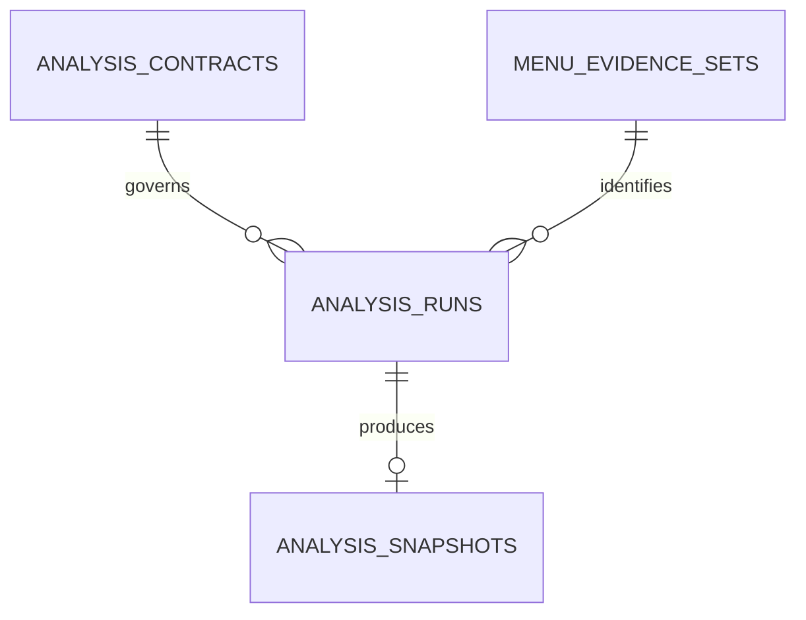
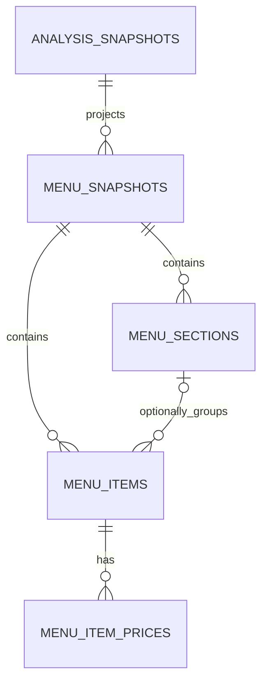
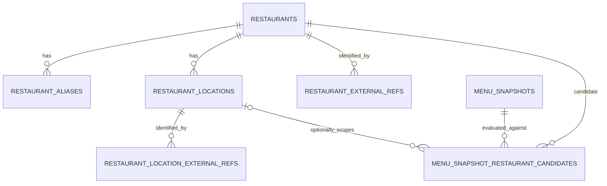
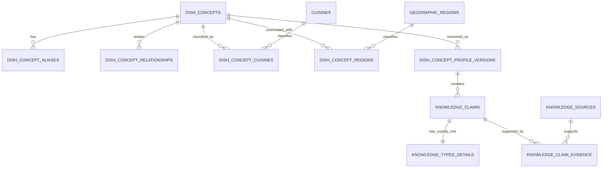

# Foodseyo Database Logical Model v3

**Status:** C2.2-B physical integrity contract linked locally; no physical schema or migration
**Reviewed:** 2026-07-17

This document is the C2.2-A and C2.2-A1 source of truth for the future relational model. It audits the external `Foodseyo Complete ERD v2` proposal against the implemented C2.1 cache, the canonical `FoodseyoAnalysis` contract, the frozen C1 consistency profile, the active MVP, and the T7/T8 ordering.

It defines responsibilities, relationships, exclusions, and unresolved decisions. It does not define PostgreSQL types, nullability, keys, triggers, grants, Drizzle tables, SQL, or migrations. Those belong to later approved checkpoints. Nothing in this document authorizes a database mutation, application integration, Preview or Production rollout, image retention, account system, or new product capability.

## Audit conclusion

The v2 proposal is useful as a long-term domain inventory but is not an implementation-ready ERD. Version 3 makes five corrections:

1. preserve the implemented four-table C2.1 cache without repurposing it;
2. make structured menu projection the smallest next database candidate;
3. defer restaurant identity until T7 supplies evidence and T8 reopens identity;
4. replace ambiguous truth links and polymorphic evidence with versioned claims and real parent relations;
5. exclude storage, accounts, personalization, and community from the active model until their own product and security decisions exist.

The status labels in this document are normative:

| Status | Meaning |
| --- | --- |
| Implemented | Existing physical C2.1 source of truth; v3 cannot redefine it |
| Candidate | Eligible for the next physical-contract audit, not yet approved for implementation |
| Deferred | Logical direction only; prerequisite product or contract work is missing |
| Excluded | Outside the active MVP and current database program |

The simplified domain map is in [database-erd-master-map-v3.mmd](./database-erd-master-map-v3.mmd).

## Non-negotiable boundaries

- Raw images remain transient. No object, filename, per-image hash, Base64, or object-storage reference is persisted.
- `analysis_snapshots.canonical_result_json` remains the immutable exact-cache artifact and canonical source for later projections.
- Structured rows are deterministic projections, not a second provider result and not a dish-level semantic cache.
- A derived row never upgrades uncertain restaurant identity, evidence basis, dietary status, or allergen safety.
- `unknown` never becomes absence, false, safe, or confirmed.
- Restaurant identity retains canonical `status`, `basis`, and `scope`; it does not use a numeric confidence as truth.
- General culinary knowledge never overrides a source-stated menu fact and is never presented as restaurant-confirmed.
- Deferred user and community tables do not become active merely because they appear in a future diagram.
- Every implementation slice receives its own Development validation and Preview/Production gate. There is no final all-at-once C2.9 rollout.

## C2.2-A1 culinary and sensory preservation audit

C2.2-A1 found that the C1 runtime contract was intact, but the first v3 wording was too generic to guarantee that a future relational design would preserve it. The following matrix closes that logical gap without changing the canonical schema or activating the deferred knowledge domain.

| Required contract | Verification after C2.2-A1 |
| --- | --- |
| Separate sensory axes | Preserved as basic tastes, flavor notes, textures, heat, and richness. |
| No ambiguous `taste` bucket | Basic tastes, flavor notes, and textures have separate vocabularies and typed claim details. No generic `taste` value may represent them. |
| Heat/richness scale isolation | Preserved as different ordered scales. Every value reference includes its scale identity, so a heat value cannot satisfy a richness relation or the reverse. |
| Baseline distribution metadata | Typed claims can carry typical value, minimum and maximum where ordered, plus prevalence, variability, calibrated culinary confidence, basis, provenance, review state, and profile version. |
| Variable culinary baseline | A baseline describes a reviewed distribution across preparations, regions, or sources. It is not a universal assertion about every restaurant instance. |
| Ingredient roles | Baseline ingredient claims distinguish `core`, `typical`, `optional`, `regional_variant`, and `preparation_dependent`. These roles are separate from C1 evidence basis. |
| Menu precedence | Frozen as `source_stated > inferred_from_source > culinary_baseline > unknown`. |
| Baseline fill behavior | Baseline claims fill only missing context, retain a visible culinary-baseline label, and are suppressed for the affected axis when menu evidence contradicts them. |
| Unknown safety | `unknown` never means absent, false, allergen-safe, dietary-safe, or available for an automatic match. |
| Heat adjustability | User-selectable spice or heat adjustment is a separate menu-specific claim and never rewrites observed or typical heat. |
| Relational typed claims | Common metadata may be shared, but every claim owns exactly one allowed typed detail. Polymorphic `(type, id)` references, unrestricted EAV, and opaque claim-value JSON are forbidden. |
| Knowledge lifecycle | Generation origin, review state, and lifecycle are separate. Model-generated, unreviewed, reviewed, superseded, and retired states remain distinguishable. |

The exact live vocabulary and normalization behavior remain owned by `foodseyo-consistency-v1` in [analysis-consistency.md](./analysis-consistency.md) and `src/lib/analysis-consistency/profile.ts`. Future knowledge profiles record the consistency-profile version they use; they do not silently reinterpret an older canonical result under a newer vocabulary.

## Implemented foundation: C2.1



| Entity | Responsibility | v3 treatment |
| --- | --- | --- |
| `analysis_contracts` | Immutable five-value provider/canonical/consistency contract identity | Retain exactly as implemented |
| `menu_evidence_sets` | Exact transient-input identity and safe source metadata | Retain exactly as implemented; do not turn it into persistent image storage |
| `analysis_runs` | Append-only ownership attempt, lease, ready/failed state, and safe error history | Retain exactly as implemented |
| `analysis_snapshots` | Immutable validated canonical result, exact result fingerprint, expiry, access, and guarded invalidation | Retain exactly as implemented |

The existing composite run/snapshot identity, one-processing-owner index, one-active-snapshot index, state checks, repository validation, and least-privilege grants remain authoritative. C2.2 must not weaken or duplicate them.

## Candidate next slice: structured menu projection

The first future relational slice is deliberately small.



### Candidate entity responsibilities

| Entity | Responsibility | Explicit non-responsibility |
| --- | --- | --- |
| `menu_snapshots` | One immutable successful projection of one canonical analysis snapshot under one projector version; preserves evidence and analysis-contract identity | Provider ownership, restaurant confirmation, mutable current-menu state |
| `menu_sections` | Ordered flat category/section labels inside one menu snapshot | Nested trees, restaurant identity, general culinary taxonomy |
| `menu_items` | Ordered source-derived menu item and translated presentation fields inside one menu snapshot; optional same-snapshot section | Reusable dish identity, cross-menu deduplication, general dish truth |
| `menu_item_prices` | Zero or more source-derived price observations for one item with explicit kind and currency context | Currency conversion, inferred price, mutable live price |

### Candidate corrections

- The proposed `analysis_snapshot_materializations` table is omitted from the first slice. A successful `menu_snapshots` row already records `(analysis_snapshot, projector_version)`; the whole projection is written in one transaction, so no partial or failed materialization row is needed.
- A later asynchronous projector may justify a separate attempt table, but it must be proven by an operational need rather than added preemptively.
- `menu_sections` are flat in the first slice. Nested sections introduce cycle prevention and are deferred until a real source requires them.
- `menu_items` reference their menu snapshot directly. The optional section must belong to the same snapshot, so unsectioned items remain representable without a synthetic category.
- Menu items are observations inside one immutable menu snapshot. They are not `dish_concepts`.
- `menu_item_option_groups` and `menu_item_option_values` remain deferred until the canonical result and user experience carry option data that must be queried relationally.

### Candidate logical invariants

C2.2-B translates these into the enforcement matrix in [database-physical-integrity-contract.md](./database-physical-integrity-contract.md):

- at most one menu snapshot per `(analysis_snapshot, projector_version)`;
- the menu snapshot's evidence set and analysis contract are identical to its source analysis snapshot;
- projection reads only a structurally and semantically valid canonical snapshot;
- snapshot, sections, items, and prices commit atomically;
- all ordering is stable and unique within the correct parent;
- an optional section belongs to the same menu snapshot as its item;
- source and translated text remain distinct;
- price kind controls whether amount and currency are required or absent;
- projections are immutable and are not used by the live route in the first implementation checkpoint;
- invalidation or expiry of the source snapshot never silently turns a derived projection into an independently trusted analysis.

### Successful materialization and failure observability

Representing success directly through `menu_snapshots` remains accepted, subject to these future physical-contract requirements:

- `(analysis_snapshot, projector_version)` is the idempotency key for a successful projection;
- the `menu_snapshots` row and all section, item, and price rows are inserted in one transaction;
- any projection, constraint, or commit failure leaves no menu snapshot or child row;
- a uniqueness race re-reads the already committed projection instead of writing a second structure;
- failed work is never represented by a partial or failed `menu_snapshots` row;
- safe operational observability records only a correlation identifier, source snapshot identifier, projector version, stage/failure code, duration, structural counts, and outcome—never menu text or canonical payload data.

The first synchronous slice may satisfy failure observability through allowlisted application telemetry. If durable retries or historical attempt audit become an operational requirement, a separately approved append-only `menu_projection_attempts` entity may be introduced. It must remain outside the menu structure, must not count as a successful projection, and must never authorize partial child rows. This preserves failure evidence without reviving the omitted `analysis_snapshot_materializations` status table.

## Restaurant and location identity: deferred until T7/T8



| Entity | Responsibility | Status |
| --- | --- | --- |
| `restaurants` | Canonical restaurant-level identity after an identity contract exists | Deferred |
| `restaurant_aliases` | Source-aware alternate names, language, and normalization | Deferred |
| `restaurant_locations` | Physical branch identity belonging to one restaurant | Deferred |
| `restaurant_external_refs` | Provider identifier whose scope is restaurant-level | Deferred |
| `restaurant_location_external_refs` | Provider identifier whose scope is branch-level | Deferred |
| `menu_snapshot_restaurant_candidates` | Preserved candidate result using canonical status, basis, scope, conflict, method, and evidence | Deferred; replaces v2 `menu_snapshot_restaurant_links` |

The word `owns` is removed: a candidate relationship does not establish ownership. A location candidate must belong to the same restaurant candidate through a composite relationship. A branch association is allowed only when canonical status is `confirmed`, scope is `branch`, and branch-specific evidence remains available.

Numeric confidence may later support internal ranking if it has a calibrated definition, but it cannot replace or upgrade canonical status, basis, scope, conflict, or evidence.

## Evidence artifacts: conditionally excluded

The v2 `menu_evidence_artifacts` and `menu_evidence_set_members` entities are removed from the active v3 model.

They may return only after a product decision approves permanent source retention and defines:

- user consent and deletion;
- storage location and access control;
- retention and expiry;
- copyright and source-excerpt policy;
- deduplication scope and cross-user hash privacy;
- object deletion after all references expire;
- whether a persisted artifact is evidence, an upload, or both.

Until then, `menu_evidence_sets` stores only the already approved exact fingerprint identity and safe metadata. The current transient image pipeline remains unchanged.

## Culinary knowledge: deferred reviewed-claim model

The culinary domain remains a long-term candidate, but v2's direct truth links are narrowed.



### Retained deferred vocabularies

- `dish_concepts`, `dish_concept_aliases`, `dish_concept_relationships`
- `cuisines`, `geographic_regions`, `dish_concept_cuisines`, `dish_concept_regions`
- `dish_concept_profile_versions`
- C1-aligned `basic_taste_terms`, `flavor_note_terms`, and `texture_terms`
- separate heat and richness ordered scales, represented through scale-bound ordinal values
- `ingredient_categories`, `ingredient_concepts`, `ingredient_aliases`
- `preparation_methods`
- `dietary_traits`, `allergens`
- `knowledge_sources`

### Replaced claim model

`knowledge_claims` is the real parent of exactly one typed claim detail. The closed detail family covers basic taste, flavor note, texture, heat, richness, ingredient, preparation, dietary, and allergen claims. The logical names are distinct even if a later physical design safely shares infrastructure:

- a basic-taste detail references one of `sweet`, `salty`, `sour`, `bitter`, or `savory` and may carry ordered intensity range;
- a flavor-note detail references the C1 flavor-note vocabulary;
- a texture detail references the C1 texture vocabulary;
- a heat detail references only the heat scale and may carry minimum, typical, and maximum heat values;
- a richness detail references only the richness scale and may carry minimum, typical, and maximum richness values;
- an ingredient detail references an ingredient concept and one of `core`, `typical`, `optional`, `regional_variant`, or `preparation_dependent`;
- preparation, dietary, and allergen details retain their own typed targets and safety semantics.

Common claim metadata owns prevalence, variability, calibrated culinary confidence, basis, generation origin, provenance, review state, lifecycle state, and profile version. Minimum, typical, and maximum values live only in a detail whose value domain is ordered. `knowledge_claim_evidence` references the real claim parent, so evidence never uses an unenforceable `(fact_type, fact_id)` pseudo-foreign-key.

The typed-detail family is closed and relational. A claim must have exactly one matching detail, enforced later through subtype keys and a constrained transaction or deferred database rule. An unrestricted `attribute_name`/`attribute_value` EAV table, arbitrary `claim_type`, or opaque JSON value cannot replace typed details.

Generation origin, review state, and lifecycle are orthogonal:

- model-generated knowledge is marked `model_generated` at origin and begins `unreviewed`;
- review may move a claim to `reviewed` or reject it, but it never rewrites its generation origin;
- replacement creates a new version and marks the old claim or profile `superseded`;
- intentionally withdrawn knowledge becomes `retired`;
- only a reviewed, current profile may supply a culinary baseline.

The following v2 tables are therefore not retained as independent top-level facts:

- `dish_concept_sensory_terms`
- `dish_concept_ordinal_attributes`
- `dish_concept_ingredients`
- `dish_concept_preparation_methods`
- `dish_concept_dietary_assessments`
- `dish_concept_allergen_assessments`
- `dish_profile_evidence_links`

Their queryable attributes move into typed detail records owned by `knowledge_claims`.

The v2 `ingredient_dietary_traits` and `ingredient_allergens` direct links are also removed. Ingredient-derived dietary or allergen information is contextual knowledge with provenance, review state, uncertainty, and versioning—not timeless truth and never a restaurant safety guarantee.

### Frozen sensory and baseline semantics

The five C1 axes remain separate:

- basic tastes: `sweet`, `salty`, `sour`, `bitter`, `savory`, with the C1 1–3 intensity domain;
- flavor notes: the versioned C1 flavor-note vocabulary;
- textures: the versioned C1 texture vocabulary;
- heat: `none < mild < medium < hot < very_hot`, plus non-orderable `unknown`;
- richness: `light < moderate < rich`, plus non-orderable `unknown`.

Basic taste, flavor note, and texture values cannot share an ambiguous `taste` column or term namespace. Heat and richness cannot share values merely because both are ordinal: every value is identified together with its scale, and every typed claim constrains the expected scale.

A dish-concept profile is a reviewed culinary baseline, not a recipe guarantee. It may represent a typical value, minimum/maximum range, prevalence across known preparations, variability by region or preparation, calibrated culinary confidence, basis, provenance, review state, and immutable profile version. These fields describe uncertainty and distribution; they do not assert that every restaurant preparation has the same characteristics.

Ingredient role and evidence basis are different dimensions. `core`, `typical`, `optional`, `regional_variant`, and `preparation_dependent` describe the baseline relationship between an ingredient and a dish concept. C1 `stated`, `typical`, and `uncertain` describe how a menu-specific ingredient claim was obtained. Neither dimension may silently promote the other.

### Deferred knowledge invariants

- profile corrections append a new version;
- at most one published profile version is active for one concept and policy;
- every published claim is reviewed, current, and has sufficient provenance;
- generation origin, review state, and active/superseded/retired lifecycle remain independently queryable;
- ordered claims preserve minimum <= typical <= maximum when those values are present;
- prevalence, variability, and confidence use explicit bounded domains rather than uncalibrated free text;
- each ordinal value belongs to the stated scale;
- heat claims accept only heat-scale values and richness claims accept only richness-scale values;
- exactly one typed detail exists per claim, and its type agrees with the parent claim kind;
- relationship type defines directionality, symmetry, duplicate reversal, and cycle policy;
- no model-created knowledge becomes published solely because it was generated;
- source-stated menu claims remain separate from culinary baseline claims.

## Menu-item analysis and merge: deferred

The normalized menu-claim model is not required to materialize sections, items, and prices. It follows only after the structured menu slice and reviewed knowledge model are justified.

Version 3 changes:

- `menu_item_concept_links` becomes `menu_item_concept_candidates`; one selected candidate is not automatically a confirmed identity.
- `menu_item_analyses` must preserve composite agreement among menu item, analysis snapshot, evidence set, and analysis contract.
- A common `menu_item_claims` parent owns basis, availability, uncertainty, and preserved evidence reference; typed sensory, ordinal, ingredient, preparation, dietary, and allergen details hang from it.
- Menu-specific basic taste, flavor note, texture, heat, and richness claims retain the same separated axes as C1.
- `menu_item_heat_adjustability_claims` records source-supported selectable spice levels or adjustment availability separately from observed menu heat and typical culinary-baseline heat.
- Evidence links reference the claim parent, not a polymorphic table/id pair.
- `menu_item_effective_profiles` is not one-to-one with an analysis. Multiple immutable outputs may exist for different merge-policy and baseline-profile versions.
- An effective profile records the exact merge policy and every baseline version used.

The precedence remains:

```text
source_stated
> inferred_from_source
> culinary_baseline
> unknown
```

A culinary baseline may fill only an otherwise missing menu context and must remain labeled as baseline rather than restaurant-confirmed. A contradiction in source evidence suppresses only the affected baseline claim; it never mutates the baseline profile or unrelated axes. `unknown` remains unknown and never means absent, false, allergen-safe, dietary-safe, or automatically compatible. Heat adjustability does not lower or raise the observed or typical heat claim; it is a separate source-backed option.

## User, personalization, Passport, and community: excluded

The following v2 entities are excluded from the active v3 model:

- `app_users`
- `user_preference_profiles`
- `user_sensory_preferences`
- `user_ordinal_preferences`
- `user_dietary_requirements`
- `user_allergen_avoidances`
- `user_saved_menu_items`
- `food_passport_entries`
- `menu_item_reviews`
- `review_media`
- `analysis_feedback`
- generic `audit_events`

They require a separate product, authentication, authorization, privacy, retention, moderation, deletion, and possibly row-level-security design. Their exclusion is not a rejection of the product idea; it prevents speculative tables from becoming an accidental MVP commitment.

A future audit system must use allowlisted safe event fields. Generic `before_json` and `after_json` payloads are not accepted because they can copy menu content, canonical results, or personal data into logs.

## Complete v2 disposition

| v2 area | Retain | Replace, merge, or narrow | Defer or exclude |
| --- | --- | --- | --- |
| Exact cache | `analysis_contracts`, `menu_evidence_sets`, `analysis_runs`, `analysis_snapshots` | None; implemented schema governs | None |
| Structured menu | `menu_snapshots`, `menu_sections`, `menu_items`, `menu_item_prices` | Flat sections first; direct snapshot identity; no separate synchronous materialization table | Option groups and values deferred |
| Restaurant | Restaurants, aliases, locations, two scope-specific external-ref tables | `menu_snapshot_restaurant_links` → candidates; remove ownership semantics and numeric-confidence truth | Entire area after T7/T8 |
| Persisted evidence | None in active model | Existing evidence set remains fingerprint identity only | Artifacts and members blocked by retention decision |
| Dish concepts | Concepts, aliases, relationships, cuisine/region mappings, profile versions | Relationship semantics and active-version policy must be explicit | Entire area deferred |
| Vocabularies | Separate C1 basic-taste, flavor-note, texture vocabularies; scale-bound heat/richness values; ingredients, preparation, dietary traits, allergens, sources | No generic `taste`; heat/richness scale identity remains part of every value reference | Entire area deferred |
| Knowledge facts | None as standalone v2 fact rows | Common `knowledge_claims`, exactly one relational typed detail, and `knowledge_claim_evidence` | EAV/opaque JSON and ingredient truth links rejected |
| Menu analysis | Menu item analyses and typed query intent | Candidate naming, common claim parent, composite identity, versioned effective profiles | Entire area deferred |
| User/community | None in active model | Future bounded-context redesign | All v2 user/community tables excluded |
| Audit | Safe structural events only in future | Remove generic entity pointer and before/after payload | Generic `audit_events` excluded |

## Relationship corrections required before physical design

1. A restaurant location must belong to the same restaurant referenced by a candidate relationship.
2. An ordinal value must belong to the same ordinal scale referenced by its claim or preference.
3. A menu snapshot must preserve the exact evidence and contract of its source analysis snapshot.
4. An optional menu section must belong to the same menu snapshot as its item.
5. A selected concept or restaurant candidate is at most one per exact context; any “must have one” rule belongs to a guarded state transition.
6. Symmetric and directional dish relationships require different duplicate and cycle rules.
7. Every evidence link must target a real claim parent with an enforceable foreign key.
8. Each knowledge or menu claim must own exactly one allowed typed detail that agrees with its claim kind.
9. Heat and richness values must remain bound to their distinct scales through enforceable relational keys.
10. Heat adjustability must not reuse the observed or baseline heat relation.
11. Soft deletion cannot silently free a natural identifier unless reuse policy explicitly allows it.
12. Append-only and immutable are permission and transaction rules, not documentation adjectives.
13. Foreign-key existence and foreign-key lookup indexing are separate physical-design checks.

## Scoped product decisions

Each decision blocks only the affected domain. C2.2-C resolves P-04 and P-06 for the bounded Development slice in [database-structured-menu-decisions.md](./database-structured-menu-decisions.md); the other decisions remain unresolved.

| ID | Decision | Safe default until decided | Blocks |
| --- | --- | --- | --- |
| P-01 | Permanently store uploaded menu artifacts? | No; transient only | Evidence artifacts and object references |
| P-02 | If stored, retention, consent, access, copyright, and deletion policy? | Store nothing | Evidence artifacts |
| P-03 | May restaurant identity ever auto-confirm? | No; preserve candidates and canonical evidence rules | Restaurant candidate selection |
| P-04 | How long are structured menu projections retained and when does source invalidation disable them? | Resolved for first slice: no TTL/deletion; source ineligibility immediately blocks reads | Preview/Production retention rollout |
| P-05 | Are nested menu sections required? | Flat sections only | Nested section hierarchy |
| P-06 | Which price kinds, currencies, ranges, and option deltas are supported? | Resolved for first slice: eligible base plus canonical price options; no conversion/deltas | Later option-group model |
| P-07 | May AI propose culinary knowledge? | Proposal or review queue only; never auto-publish | Knowledge ingestion |
| P-08 | Who may review and publish a knowledge profile? | No published profile without an authority model | Knowledge publication |
| P-09 | What source excerpts may be retained? | Identifiers and safe citations only; no copied excerpt | Knowledge evidence |
| P-10 | Does a changed baseline create a new effective profile automatically? | Recompute only through an explicit versioned job | Effective guidance |
| P-11 | Authentication and anonymous identity model? | No persistent user identity | User tables |
| P-12 | Store allergen severity or medical-adjacent profile data? | No | Personalization |
| P-13 | Food Passport visibility and deletion defaults? | Private concept only; no implementation | Passport |
| P-14 | Review, media, moderation, and privacy policy? | No community storage | Community |
| P-15 | How are culinary prevalence, variability, and confidence calibrated? | Use no public numeric certainty and publish no baseline until bounded semantics are reviewed | Knowledge publication |
| P-16 | Which source-backed heat-adjustment states are supported? | Preserve only explicit source text; do not infer adjustability | Menu heat-adjustability claims |

## Revised checkpoint order

### C2.2-A — logical model audit

Completed by this document. No database or runtime change.

### C2.2-A1 — culinary-contract gap audit

Completed by the preservation matrix and typed-claim clarifications above. The C1 runtime vocabulary, canonical schema, and C2.1 physical database remain unchanged.

### C2.2-B — physical integrity contract

Completed in [database-physical-integrity-contract.md](./database-physical-integrity-contract.md) without schema code, SQL, migration, or database access. It defines columns, PostgreSQL types, nullability, defaults, keys, deletion behavior, uniqueness, checks, indexes, immutability, grants, and enforcement ownership for:

- the implemented four-table C2.1 foundation as a compatibility boundary;
- only the four candidate structured-menu tables.

Deferred domains do not receive speculative physical contracts yet.

### C2.2-C — scoped product and security decisions

Completed in [database-structured-menu-decisions.md](./database-structured-menu-decisions.md). P-04 and P-06 are fixed for the bounded Development slice. Community, authentication, image-retention, restaurant, and knowledge decisions remain scoped to their deferred domains.

### C2.2-D — unexecuted schema draft

Prepare reviewed Drizzle and SQL drafts for the approved next slice, validate dependency order and static integrity, but do not connect to a database or generate a migration until separately authorized.

### C2.3 — Development-only structured menu implementation

If C2.2-B/C/D pass, implement the approved minimal projection in Development with atomic rollback and real PostgreSQL validation. Do not add it to the live read path in the same checkpoint.

### T7/T8 before restaurant identity implementation

T7 source acquisition must define normalized URLs, SSRF defense, source classification, and preserved evidence. T8 then reopens restaurant and branch identity. Restaurant tables are not a prerequisite for T7.

### Later bounded contexts

- reviewed culinary knowledge only after a concrete search, comparison, or merge use case;
- menu-specific normalized claims and effective profiles after knowledge governance;
- users, Passport, and community only after authentication and privacy design.

Every implemented slice uses the C2.1-G rollout protocol independently:

```text
Development migration and adversarial validation
→ least-privilege verification
→ separately authorized Preview migration and QA
→ rollback rehearsal
→ separate Production go/no-go
```

## C2.2-D entry gate

C2.2-D begins from the completed logical, physical, and [structured-menu decision](./database-structured-menu-decisions.md) contracts. It is limited to an unexecuted Drizzle and SQL draft for the four candidate tables. It must not:

- redefine the four C2.1 tables;
- include evidence artifacts, restaurant identity, knowledge, user, or community tables;
- expand the accepted price or retention scope;
- create or run a migration;
- access Neon, Vercel, Preview, or Production;
- change the live analysis route or canonical contract.
