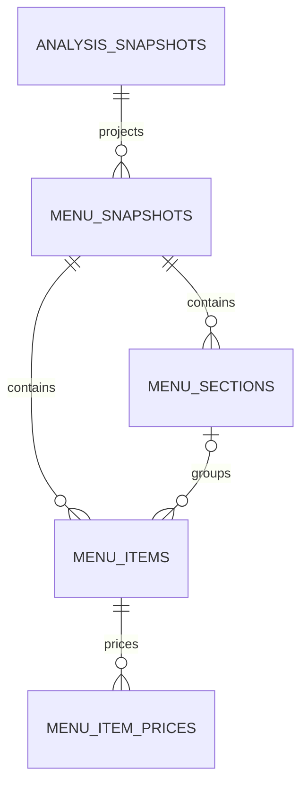

# Foodseyo C2.2-B Physical Integrity Contract

**Status:** C2.2-B documentation contract accepted locally; no schema code, SQL, migration, or database change

**Reviewed:** 2026-07-17

This document is the physical-design source of truth for the next bounded database slice. It translates the accepted C2.2-A/A1 logical model into PostgreSQL column, key, constraint, index, immutability, transaction, and privilege requirements.

It is not executable. The implemented C2.1 Drizzle schema and reviewed migration remain authoritative for the four existing tables. The four structured-menu tables below are candidate contracts only. C2.2-B does not create Drizzle definitions, SQL, migrations, repositories, connections, rows, platform changes, or runtime behavior.

## Scope

Included:

- the implemented C2.1 compatibility boundary:
  - `analysis_contracts`
  - `menu_evidence_sets`
  - `analysis_runs`
  - `analysis_snapshots`
- the next structured-menu candidate:
  - `menu_snapshots`
  - `menu_sections`
  - `menu_items`
  - `menu_item_prices`

Excluded:

- evidence artifacts or stored images;
- restaurants and locations;
- dish concepts and culinary knowledge;
- menu sensory, dietary, allergen, or effective-profile claims;
- option groups, option values, and add-on price deltas;
- users, personalization, Passport, community, and generic audit events;
- materialization-attempt storage;
- any Preview or Production rollout.

## Contract conventions

- All identifiers are PostgreSQL `uuid`.
- New identifiers use `gen_random_uuid()` only as a database default.
- Timestamps are `timestamp with time zone`.
- Ordered child positions are zero-based PostgreSQL `integer` values supplied explicitly.
- Human-readable values use `text`; non-null text is trimmed and nonblank unless stated otherwise.
- Nullable text uses `NULL` for unknown. Empty strings are normalized to `NULL` before persistence.
- Money uses exact PostgreSQL `numeric`, never floating point. A stored amount is finite and nonnegative.
- `ON UPDATE RESTRICT` is required for every new foreign key because identities are immutable.
- `ON DELETE RESTRICT` is required for every new foreign key until a separately approved retention policy exists.
- No new table uses soft deletion. Source snapshot invalidation remains in C2.1 and is evaluated at read time.
- Constraint and index names are explicit, stable, and validated later; C2.2-D may choose final names without changing the semantics below.
- PostgreSQL constraints protect row and relationship integrity. Cross-row completeness and canonical semantic validity belong to one guarded transaction service and its tests.

## Implemented C2.1 compatibility boundary

C2.2-B accepts the existing four-table physical shape exactly. No new column, key, index, trigger, or privilege is required on these tables for the structured-menu slice.

### `analysis_contracts`

| Column | PostgreSQL type | Null | Default | Mutability |
| --- | --- | --- | --- | --- |
| `id` | `uuid` | No | `gen_random_uuid()` | Immutable |
| `model_version` | `text` | No | None | Immutable |
| `prompt_version` | `text` | No | None | Immutable |
| `provider_schema_version` | `text` | No | None | Immutable |
| `canonical_schema_version` | `text` | No | None | Immutable |
| `consistency_profile_version` | `text` | No | None | Immutable |
| `created_at` | `timestamptz` | No | current timestamp | Immutable |

Enforced by the existing schema:

- primary key on `id`;
- candidate key across all five version columns;
- every version column is nonblank;
- append-only runtime access;
- no soft delete.

### `menu_evidence_sets`

| Column | PostgreSQL type | Null | Default | Mutability |
| --- | --- | --- | --- | --- |
| `id` | `uuid` | No | `gen_random_uuid()` | Immutable |
| `input_kind` | `text` | No | None | Immutable |
| `source_fingerprint` | `text` | No | None | Immutable |
| `fingerprint_version` | `text` | No | None | Immutable |
| `image_count` | `integer` | Yes | None | Immutable |
| `normalized_url` | `text` | Yes | None | Immutable |
| `source_provider` | `text` | Yes | None | Immutable |
| `observed_at` | `timestamptz` | No | current timestamp | Immutable |
| `created_at` | `timestamptz` | No | current timestamp | Immutable |

Enforced by the existing schema:

- primary key on `id`;
- candidate key on `(source_fingerprint, fingerprint_version)`;
- closed `input_kind` vocabulary;
- positive `image_count` when present;
- nonblank optional URL/provider values;
- uploaded images require an image count and prohibit a stored URL;
- non-image sources require a normalized URL;
- no raw image, Base64, filename, per-image hash, EXIF, or menu content;
- append-only runtime access and no soft delete.

### `analysis_runs`

| Column | PostgreSQL type | Null | Default | Mutability |
| --- | --- | --- | --- | --- |
| `id` | `uuid` | No | `gen_random_uuid()` | Immutable |
| `menu_evidence_set_id` | `uuid` | No | None | Immutable |
| `analysis_contract_id` | `uuid` | No | None | Immutable |
| `status` | `text` | No | None | Guarded mutable |
| `attempt_number` | `integer` | No | None | Immutable |
| `safe_error_code` | `text` | Yes | None | Guarded mutable |
| `started_at` | `timestamptz` | No | current timestamp | Immutable |
| `lease_expires_at` | `timestamptz` | Yes | None | Guarded mutable |
| `finished_at` | `timestamptz` | Yes | None | Guarded mutable |
| `created_at` | `timestamptz` | No | current timestamp | Immutable |
| `updated_at` | `timestamptz` | No | current timestamp | Guarded mutable |

Enforced by the existing schema:

- primary key on `id`;
- `ON DELETE RESTRICT`, non-deferrable foreign keys to evidence and contract; current `ON UPDATE` action is PostgreSQL `NO ACTION`;
- candidate keys on `(menu_evidence_set_id, analysis_contract_id, attempt_number)` and `(id, menu_evidence_set_id, analysis_contract_id)`;
- status is `processing`, `ready`, or `failed`;
- attempt number is at least one;
- state-dependent lease, finish, and safe-error nullability;
- monotonic timestamp checks;
- partial unique index allowing one `processing` row per evidence/contract identity;
- lookup index beginning with evidence and contract identity;
- only the five guarded state columns are runtime-updatable;
- no delete and no soft delete.

Repository and transaction guards, not a row `CHECK`, enforce valid `processing -> ready` or `processing -> failed` transitions, ownership, lease comparison against current time, and attempt-number allocation.

### `analysis_snapshots`

| Column | PostgreSQL type | Null | Default | Mutability |
| --- | --- | --- | --- | --- |
| `id` | `uuid` | No | `gen_random_uuid()` | Immutable |
| `menu_evidence_set_id` | `uuid` | No | None | Immutable |
| `analysis_contract_id` | `uuid` | No | None | Immutable |
| `analysis_run_id` | `uuid` | No | None | Immutable |
| `result_fingerprint` | `text` | No | None | Immutable |
| `canonical_result_json` | `jsonb` | No | None | Immutable |
| `created_at` | `timestamptz` | No | current timestamp | Immutable |
| `last_accessed_at` | `timestamptz` | No | current timestamp | Guarded mutable |
| `expires_at` | `timestamptz` | Yes | None | Immutable |
| `invalidated_at` | `timestamptz` | Yes | None | Guarded mutable |
| `safe_invalidation_code` | `text` | Yes | None | Guarded mutable |

Enforced by the existing schema:

- primary key on `id`;
- `ON DELETE RESTRICT`, non-deferrable foreign keys to evidence and contract; current `ON UPDATE` action is PostgreSQL `NO ACTION`;
- composite foreign key from `(analysis_run_id, menu_evidence_set_id, analysis_contract_id)` to the matching run candidate key;
- canonical JSON must be a JSON object;
- nonblank result fingerprint;
- valid expiry, access, and invalidation timestamps;
- paired invalidation timestamp and safe code;
- non-unique result-fingerprint lookup index;
- partial unique index allowing one non-invalidated snapshot per evidence/contract identity;
- only access and invalidation fields are runtime-updatable;
- no delete and no soft delete.

The atomic persistence service, not a row constraint, proves that the producing run is the confirmed unexpired owner, inserts the snapshot, and changes the same run to `ready` in one transaction. Structural, semantic, exact-contract, and fingerprint validation remains mandatory before any reuse.

### Existing role and ownership boundary

- `foodseyo_migrator` owns the four tables and migration ledger.
- `foodseyo_runtime` has schema `USAGE` but no `CREATE`.
- Runtime has `SELECT` and `INSERT` on the four application tables.
- Runtime has column-limited `UPDATE` only on the reviewed run-state and snapshot-access/invalidation fields.
- Runtime has no `DELETE`, table ownership, migration-ledger access, administrative role attribute, or immutable-column update.
- `PUBLIC` has no table privilege.

These privileges remain unchanged in C2.2-B.

## Structured-menu aggregate

`menu_snapshots` stores only `analysis_snapshot_id`; it does not copy `menu_evidence_set_id` or `analysis_contract_id`. Evidence and contract identity are reached through the immutable source snapshot. This removes an otherwise redundant mismatch state and requires no supporting change to the C2.1 tables.

### `menu_snapshots`

| Column | PostgreSQL type | Null | Default | Meaning |
| --- | --- | --- | --- | --- |
| `id` | `uuid` | No | `gen_random_uuid()` | Surrogate aggregate identifier |
| `analysis_snapshot_id` | `uuid` | No | None | Exact validated canonical source snapshot |
| `projector_version` | `text` | No | None | Deterministic projector contract |
| `title` | `text` | Yes | None | Canonical menu title; blank normalizes to null |
| `currency` | `text` | Yes | None | Canonical currency context; not assumed to be ISO and never converted |
| `projected_at` | `timestamptz` | No | current timestamp | Successful transaction timestamp |

Keys and relationships:

- primary key on `id`;
- candidate key on `(analysis_snapshot_id, projector_version)`;
- foreign key `analysis_snapshot_id -> analysis_snapshots.id`;
- `ON DELETE RESTRICT`, `ON UPDATE RESTRICT`;
- no evidence/contract copy and therefore no cross-identity mismatch state.

Checks:

- `projector_version` matches the existing version-token domain: 1–100 ASCII letters, digits, `.`, `_`, or `-`, beginning with an alphanumeric character;
- `title` and `currency` are null or trimmed and nonblank.

Indexes:

- the unique candidate key supports idempotency and source lookup;
- no additional index is required in the first slice.

All columns are immutable. There is no status, update timestamp, invalidation column, or soft-delete flag.

### `menu_sections`

| Column | PostgreSQL type | Null | Default | Meaning |
| --- | --- | --- | --- | --- |
| `id` | `uuid` | No | `gen_random_uuid()` | Section identifier |
| `menu_snapshot_id` | `uuid` | No | None | Owning menu snapshot |
| `analysis_category_id` | `text` | No | None | Category ID from the canonical analysis |
| `position` | `integer` | No | None | Zero-based canonical category order |
| `label` | `text` | No | None | Canonical category label |

Keys and relationships:

- primary key on `id`;
- candidate keys on `(menu_snapshot_id, analysis_category_id)` and `(menu_snapshot_id, position)`;
- supporting candidate key on `(id, menu_snapshot_id)` for same-snapshot item references;
- foreign key `menu_snapshot_id -> menu_snapshots.id`;
- `ON DELETE RESTRICT`, `ON UPDATE RESTRICT`.

Checks:

- `analysis_category_id` and `label` are trimmed and nonblank;
- `position >= 0`.

The candidate-key indexes cover snapshot lookup and ordered reads. All columns are immutable. Sections are flat; there is no parent-section column.

### `menu_items`

| Column | PostgreSQL type | Null | Default | Meaning |
| --- | --- | --- | --- | --- |
| `id` | `uuid` | No | `gen_random_uuid()` | Menu-item observation identifier |
| `menu_snapshot_id` | `uuid` | No | None | Owning menu snapshot |
| `menu_section_id` | `uuid` | Yes | None | Optional section in the same snapshot |
| `analysis_dish_id` | `text` | No | None | Dish ID from the canonical analysis |
| `position` | `integer` | No | None | Zero-based canonical dish order |
| `display_name` | `text` | No | None | Canonical display name |
| `original_name` | `text` | Yes | None | Distinct original-language name when present |
| `menu_description` | `text` | Yes | None | Source-derived menu description when present |

Keys and relationships:

- primary key on `id`;
- candidate keys on `(menu_snapshot_id, analysis_dish_id)` and `(menu_snapshot_id, position)`;
- foreign key `menu_snapshot_id -> menu_snapshots.id`;
- composite foreign key `(menu_section_id, menu_snapshot_id) -> menu_sections(id, menu_snapshot_id)`;
- nullable `menu_section_id` represents an unsectioned item;
- all foreign keys use `ON DELETE RESTRICT`, `ON UPDATE RESTRICT`.

Checks:

- `analysis_dish_id` and `display_name` are trimmed and nonblank;
- `original_name` and `menu_description` are null or trimmed and nonblank;
- `position >= 0`.

Indexes:

- candidate-key indexes cover snapshot identity and ordered reads;
- a partial lookup index on `(menu_section_id, menu_snapshot_id, position)` where `menu_section_id` is not null supports section reads and the composite foreign key.

All columns are immutable. The item is an observation in one menu snapshot, not a reusable dish concept.

### `menu_item_prices`

The first slice stores only numeric canonical prices that retain direct source evidence. Unknown prices create no row. Zero is stored only when zero was explicitly present; it is never an unknown fallback.

| Column | PostgreSQL type | Null | Default | Meaning |
| --- | --- | --- | --- | --- |
| `id` | `uuid` | No | `gen_random_uuid()` | Price observation identifier |
| `menu_item_id` | `uuid` | No | None | Owning menu item |
| `analysis_price_id` | `text` | Yes | None | Canonical price-option ID; null for base price |
| `position` | `integer` | No | None | Zero-based stable price order |
| `price_kind` | `text` | No | None | `base` or `option` |
| `context_label` | `text` | Yes | None | Canonical option label; null for base price |
| `amount` | `numeric` | No | None | Exact finite nonnegative amount |
| `currency` | `text` | Yes | None | Exact canonical currency; null remains unknown |
| `display_text` | `text` | No | None | Canonical source-derived price display |

Keys and relationships:

- primary key on `id`;
- candidate key on `(menu_item_id, position)`;
- unique constraint on `(menu_item_id, analysis_price_id)`; PostgreSQL's ordinary null-distinct behavior permits only the base row to use null under the kind check;
- partial unique index on `menu_item_id` where `price_kind = base`;
- foreign key `menu_item_id -> menu_items.id`;
- `ON DELETE RESTRICT`, `ON UPDATE RESTRICT`.

Checks:

- `position >= 0`;
- `price_kind` is `base` or `option`;
- `amount` is finite and `amount >= 0`;
- `display_text` is trimmed and nonblank;
- `currency` is null or trimmed and nonblank;
- a base row has null `analysis_price_id` and null `context_label`;
- an option row has nonblank `analysis_price_id` and nonblank `context_label`.

The first slice does not store ranges, market-price markers, inferred prices, conversions, option-group values, or add-on deltas. A canonical price option with a null `Money` value creates no price row; its non-price option metadata remains deferred.

Per the accepted [C2.2-C decisions](./database-structured-menu-decisions.md), the projector builds a contiguous zero-based eligible-price sequence with an eligible base price first and eligible canonical price options in their original array order. `dish.options[].additionalPrice` remains excluded.

All columns are immutable.

## Projection transaction contract

A successful materialization is one aggregate transaction:

1. Read the source `analysis_snapshots` row.
2. Confirm it is active, unexpired, structurally valid, semantically valid, and exact-contract/fingerprint valid.
3. Require a non-failed canonical result with a non-null menu and at least one dish.
4. Normalize only blank optional text to null; do not invent, translate, infer, or convert values.
5. Insert one `menu_snapshots` row with an explicit projector version.
6. Insert every canonical category once in array order.
7. Insert every canonical dish once in array order, using the same-snapshot section relation.
8. Insert the base price and non-null canonical price options only when their evidence is available, directly observed or externally sourced, and has source IDs.
9. Commit only after all inserts and completeness checks pass.

Any validation, insert, constraint, or commit failure rolls back the header and every child. Readers cannot observe partial structures. A conflict on `(analysis_snapshot_id, projector_version)` rolls back the losing attempt and re-reads the already committed aggregate; it does not create a second projection.

The transaction service verifies cross-row conditions that a row `CHECK` cannot express safely:

- every source category and dish is represented exactly once;
- no extra category, dish, or price is created;
- positions preserve canonical array order;
- every optional section reference resolves within the same snapshot;
- original and display names are not merged;
- only direct source-backed numeric prices are projected;
- the aggregate contains at least one item;
- the inserted row counts match the validated source arrays before commit.

## Source invalidation and expiry

A menu projection never becomes an independently trusted analysis:

- reads join through `menu_snapshots.analysis_snapshot_id`;
- an invalidated or expired source snapshot makes the projection ineligible for public use;
- current time and canonical semantic validity remain application read guards because volatile time and JSON semantics are not stable row `CHECK` expressions;
- no projection row is mutated or deleted when the source is invalidated;
- C2.2-C approves no projection TTL or automatic row deletion for the Development-only slice;
- a separate retention and deletion decision remains mandatory before Preview or Production rollout.

## Failure observability

Failed projection attempts create no menu-structure row. Safe telemetry may contain only:

- a safe correlation identifier;
- projector version;
- safe stage and failure code;
- duration;
- category, item, and price counts;
- success, conflict-reuse, or rollback outcome.

Telemetry must not contain source or result fingerprints, menu text, names, descriptions, price display text, canonical JSON, images, filenames, provider output, URLs, environment values, or credentials.

No `menu_projection_attempts` table is part of C2.2-B. Durable retry or attempt history requires a separately approved operational need and must remain outside the structured-menu aggregate.

## Enforcement ownership matrix

| Invariant | PostgreSQL | Transaction service | Application validation | Product/manual gate |
| --- | --- | --- | --- | --- |
| One projection per source snapshot/projector | Unique candidate key | Conflict rollback and committed-winner re-read | Explicit projector version | None |
| Evidence/contract identity agreement | Normalized FK to source snapshot | Read source identity once | Exact-contract snapshot validation | None |
| No partial menu aggregate | Transaction atomicity and FK/unique checks | Insert and completeness check in one transaction | Repository exposes no independent public writes | None |
| Stable unique ordering | Nonnegative checks and parent-position uniqueness | Preserve source array order | Integer/order validation | None |
| Same-snapshot section membership | Composite foreign key | Resolve category map within transaction | Reject missing category references | None |
| Distinct original/display text | Separate columns | No field merging | Blank-to-null only | None |
| Direct source-backed prices only | Typed rows and price checks | Filter and order by the accepted price contract | Validate availability, basis, source IDs, finite amount | P-06 resolved for the first slice |
| Unknown is not zero | Nullable absence means no row | Never synthesize price | Canonical evidence validation | None |
| Immutable projection | Runtime has no update/delete | No mutation repository | No public read path in the first slice | P-04 resolved for Development only |
| Source invalidation blocks reuse | Source FK retains history | None | Active/unexpired source read guard | Separate rollout decision before Preview |
| Safe failure observability | No partial/failure rows | Rollback outcome only | Allowlisted structural telemetry | Durable-attempt decision if ever needed |
| Least privilege | Grants and ownership | Controlled transaction | Server-only pooled runtime | Separate rollout approval |

No trigger, exclusion constraint, RLS policy, generated column, or stored procedure is required for the first slice. Adding one later requires a demonstrated invariant that the selected enforcement layer cannot safely maintain.

## Privilege contract for the four candidate tables

When a later authorized migration creates these tables:

- owner: `foodseyo_migrator`;
- `PUBLIC`: no privilege;
- `foodseyo_runtime`: `SELECT`, `INSERT`;
- `foodseyo_runtime`: no `UPDATE`, `DELETE`, `TRUNCATE`, `REFERENCES`, `TRIGGER`, ownership, or schema `CREATE`;
- no migration-ledger access;
- no sequence privilege is needed because IDs use UUID defaults;
- all grants are explicit in the reviewed migration;
- default privileges must not silently broaden future runtime access.

There is no RLS requirement because the slice has no user or tenant identity and is reachable only through the server runtime. Authentication or multi-tenant data would require a separate security design before changing that conclusion.

## Dependency order for a later unexecuted draft

C2.2-D may draft, but not apply, objects in this dependency order:

1. verify the unchanged C2.1 compatibility boundary;
2. `menu_snapshots`;
3. `menu_sections`;
4. `menu_items`, including the same-snapshot composite foreign key;
5. `menu_item_prices`;
6. supporting and partial indexes;
7. explicit revokes and grants;
8. static schema/constraint/privilege validation.

No C2.1 table alteration is required by this order.

## C2.2-D static realization

[C2.2-D](./database-schema-draft.md) realizes this contract as a separated Drizzle design and PostgreSQL review draft. Static validation proves column, key, foreign-key, check, index, privilege, and SQL parity while keeping the active schema export and migration directory unchanged. The draft is not executable and authorizes no database operation.

## C2.2-C decisions resolved

[C2.2-C](./database-structured-menu-decisions.md) confirms:

- a Development-only projection with no public read path, projection TTL, row deletion, soft deletion, or runtime mutation;
- immediate read ineligibility when the source snapshot is invalidated, expired, or otherwise fails exact validation, without mutating the projection;
- isolated rollback or disposable-child-branch validation that leaves no application rows or temporary branches;
- one eligible base price plus eligible non-null canonical price options in source order;
- exact source amount, nullable currency, and display text with no conversion or inference;
- no ranges, market-price markers, option groups, `additionalPrice` deltas, or row for unknown prices.

These decisions authorize only the unexecuted C2.2-D draft. Retention and deletion for Preview or Production remain a separate rollout gate.

## C2.2-B exit classification

The contract is complete when:

- the C2.1 compatibility mirror matches the executable schema and migration;
- all four candidate tables have explicit types, nullability, defaults, keys, foreign-key actions, checks, indexes, mutability, deletion, and grant rules;
- every cross-row invariant has an enforcement owner;
- the candidate dependency graph has no cycle;
- C2.2-C first-slice decisions are explicit;
- no executable schema, SQL, migration, repository, database action, or rollout exists.
